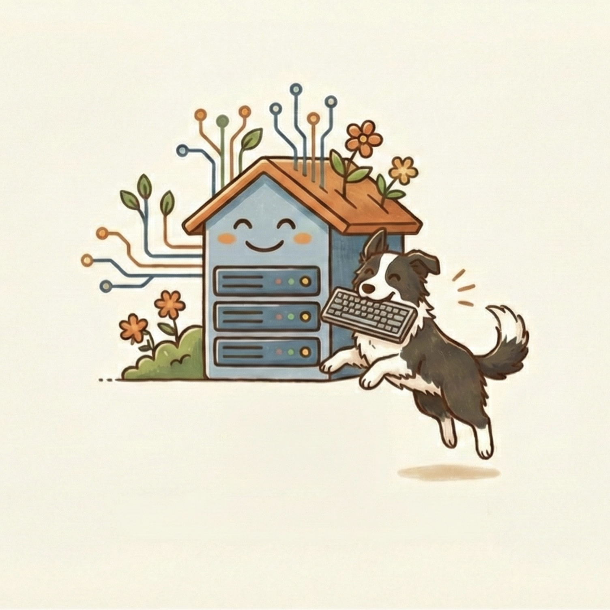
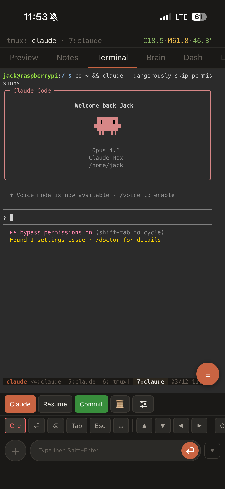

<p align="center">
  <a href="README.md">English</a> · <a href="README.ko.md">한국어</a>
</p>

<p align="center">
  
</p>

<h1 align="center">Claude Terminal</h1>

<p align="center">
  Access <a href="https://docs.anthropic.com/en/docs/claude-code">Claude Code</a> from anywhere — a mobile-first web terminal you can self-host.
</p>

<p align="center">
  <a href="https://github.com/BaskBoomy/claude-terminal/blob/master/LICENSE"></a>
  <a href="https://github.com/BaskBoomy/claude-terminal/releases"></a>
  
  
  
</p>

<br>

> **What is this?** A self-hosted PWA that wraps Claude Code in a touch-friendly web UI. Install it on a Raspberry Pi, VPS, or any always-on machine — then open it from your phone, tablet, or any browser. One server, access from everywhere.

<br>

<!-- screenshot placeholder -->
<!-- <p align="center"></p> -->

## Why

Claude Code is powerful, but it only runs in a local terminal. If you want to:

- **Code from your phone** while away from your desk
- **Monitor long-running tasks** without keeping a laptop open
- **Manage Claude's memory and skills** with a visual editor
- **Check git status and server health** at a glance

...you need a way to access your terminal remotely. Claude Terminal gives you that in a single ~8MB binary with zero external dependencies.

## Features

| Tab | What it does |
|-----|-------------|
| **Terminal** | Full xterm.js terminal with touch scrolling, swipe-to-switch tmux windows, virtual key bar |
| **Preview** | Multi-tab browser for previewing web apps your code is building |
| **Notes** | Markdown notes with auto-save — send any note directly to Claude as a prompt |
| **Brain** | Browse and edit Claude Code's memory, skills, agents, rules, and hooks |
| **Dash** | Git status, Claude API usage metrics, CPU/memory/disk/temperature at a glance |

**Plus:** custom command snippets, configurable fonts, drag-to-reorder tabs, pull-to-refresh, copy mode (screen + scrollback), wake lock, background notifications, and installable as a home screen app on iOS/Android.

## Quick Start

**Option 1 — One command (requires Node.js):**

```bash
npx create-claude-terminal
```

The interactive installer will prompt for your password, ports, and domain, then set up everything including systemd/launchd services.

**Option 2 — Git clone:**

```bash
git clone https://github.com/BaskBoomy/claude-terminal.git
cd claude-terminal
./install.sh
```

**Option 3 — Manual setup:**

```bash
# 1. Install prerequisites
sudo apt install tmux    # or: brew install tmux

# 2. Install ttyd
sudo bash scripts/setup-ttyd.sh

# 3. Configure
cp .env.example .env
nano .env                # set PASSWORD at minimum

# 4. Build & run
go build -ldflags="-s -w" -o claude-terminal .
ttyd -p 7681 -W -b /ttyd scripts/ttyd-start.sh &
./claude-terminal
```

Open `http://<your-ip>:7680` and log in.

## Architecture

```
 Phone / Tablet / Desktop
          │
          │  HTTPS (auto Let's Encrypt) or HTTP
          ▼
 ┌──────────────────────┐
 │   claude-terminal    │  single Go binary (~8MB)
 │                      │
 │  ┌────────────────┐  │
 │  │  Static files  │  │  PWA frontend (HTML/CSS/JS)
 │  │  API routes    │  │  auth, notes, brain, settings, git, usage
 │  │  ttyd proxy    │  │  reverse proxy with WebSocket tunneling
 │  └────────────────┘  │
 └──────────┬───────────┘
            │ localhost
            ▼
 ┌──────────────────────┐
 │       ttyd           │  web terminal emulator
 └──────────┬───────────┘
            │
            ▼
 ┌──────────────────────┐
 │       tmux           │  persistent terminal sessions
 │  ┌────────────────┐  │
 │  │  Claude Code   │  │  AI coding assistant
 │  └────────────────┘  │
 └──────────────────────┘
```

No Docker, no Nginx, no Caddy — just one binary + ttyd + tmux.

## Configuration

All settings live in `.env` (see [`.env.example`](.env.example)):

| Variable | Default | Description |
|----------|---------|-------------|
| `PASSWORD` | *(required)* | Login password — hashed automatically on first run |
| `PORT` | `7680` | Server port |
| `TTYD_PORT` | `7681` | ttyd port |
| `DOMAIN` | | Your domain — enables automatic HTTPS via Let's Encrypt |
| `CLAUDE_CMD` | `claude` | Command to launch Claude Code |
| `TMUX_SESSION` | `claude` | tmux session name |
| `SESSION_MAX_AGE` | `86400` | Login session lifetime in seconds (24h) |

<details>
<summary>All variables</summary>

| Variable | Default | Description |
|----------|---------|-------------|
| `HOST` | `0.0.0.0` | Bind address |
| `TMUX_SOCKET` | *(auto)* | tmux socket path |
| `UPLOAD_DIR` | `/tmp/claude-uploads` | File upload directory |
| `NOTIFY_DIR` | `/tmp/claude-notify` | Notification directory |
| `RATE_LIMIT_MAX` | `5` | Max failed login attempts per IP |
| `RATE_LIMIT_WINDOW` | `900` | Rate limit window in seconds (15min) |

</details>

## HTTPS

**Built-in (recommended for single-service setups):**

Set `DOMAIN=your.domain.com` in `.env`. The server automatically obtains and renews Let's Encrypt certificates.

**Behind a reverse proxy:**

If you already run Caddy, Nginx, or similar:

```
# Caddyfile example
your.domain.com {
    reverse_proxy localhost:7680
}
```

## Security

- **Password hashing** — PBKDF2-SHA256 with 600,000 iterations
- **Session cookies** — `HttpOnly`, `Secure` (when HTTPS), `SameSite=Strict`
- **Rate limiting** — 5 failed attempts per 15 minutes per IP
- **Path traversal protection** — Brain file access restricted to known project directories
- **No credentials in source** — password hash stored in `data/` (gitignored)

## Project Structure

```
claude-terminal/
├── main.go              # HTTP server, ttyd reverse proxy, auto HTTPS
├── config.go            # .env loading, password hashing
├── auth.go              # sessions, rate limiting, middleware
├── routes.go            # API handlers (tmux, notes, brain, git, usage)
├── brain.go             # Claude Code memory/skills file scanner
├── public/              # PWA frontend
│   ├── index.html
│   ├── login.html
│   ├── css/style.css
│   └── js/              # ES modules (app, terminal, preview, notes, brain, dash, ...)
├── scripts/
│   ├── ttyd-start.sh    # tmux session entry point
│   └── setup-ttyd.sh    # ttyd installer
├── npm/                 # npx create-claude-terminal package
├── install.sh           # one-click setup script
├── .env.example         # configuration template
└── data/                # runtime data — notes, settings, password hash (gitignored)
```

## Requirements

| Dependency | Purpose | Install |
|-----------|---------|---------|
| **tmux** | Persistent terminal sessions | `apt install tmux` / `brew install tmux` |
| **ttyd** | Web terminal emulator | `bash scripts/setup-ttyd.sh` (auto-installed) |
| **Claude Code** | AI coding assistant | [Installation guide](https://docs.anthropic.com/en/docs/claude-code) |
| **Go 1.22+** | Build from source | [golang.org](https://go.dev/dl/) *(not needed if using pre-built binary)* |

## Contributing

Contributions are welcome! Feel free to open issues and pull requests.

1. Fork the repo
2. Create your branch (`git checkout -b feature/amazing-feature`)
3. Commit your changes
4. Push to the branch (`git push origin feature/amazing-feature`)
5. Open a Pull Request

## License

Distributed under the MIT License. See [`LICENSE`](LICENSE) for details.

---

<p align="center">
  Built for developers who code from everywhere.
</p>
